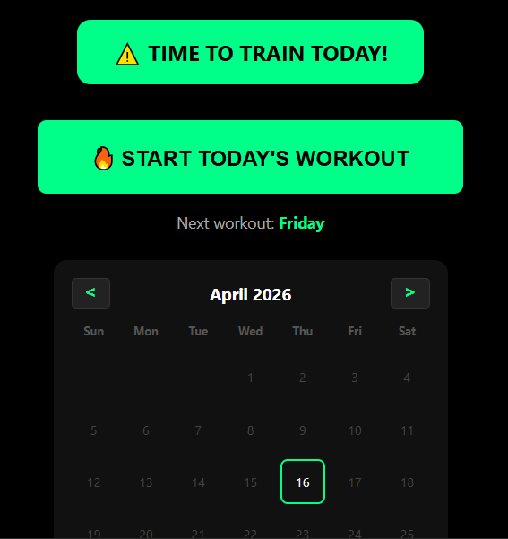
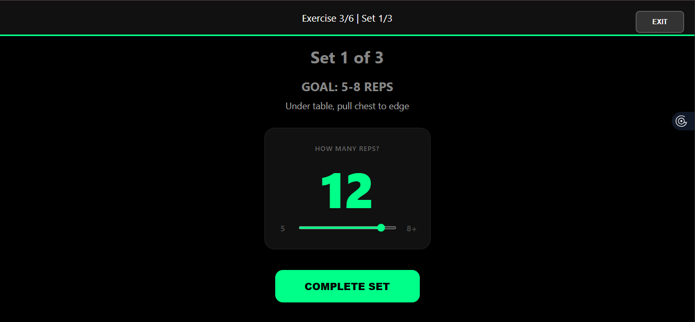
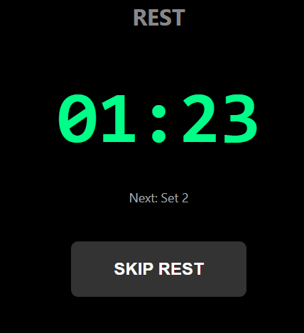
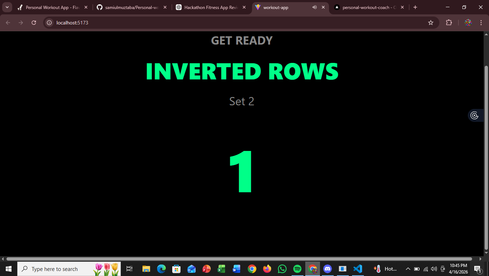
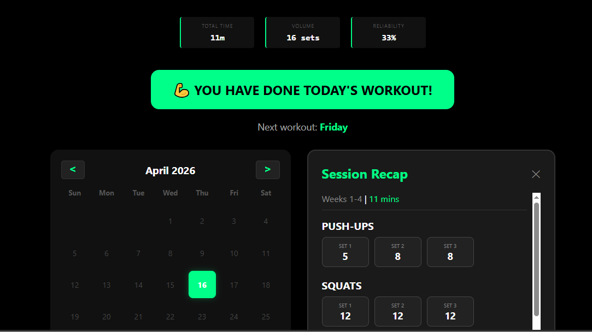

# Personal Workout App
[Click here to see the project](https://personal-workout-coach.vercel.app/)

<details> <summary>What Inspired Me</summary>
I wasn't very healthy and was quite skinny, which prompted me to start caring about my health. That's when I decided I needed to begin exercising regularly (along with improving my sleep schedule and focusing on nutrition). I sought help from Claude, who created a workout routine for me. 

While I could have simply followed it, I thought automating the process would be more beneficial, especially since the routine changed every four weeks and included built-in rest timers and progress tracking.
</details>

## About
This project is a React workout coach app designed to automate a personal 12-week bodyweight training program. It helps users track their progress, manage workout days, and keep a history of their sessions in the browser using local storage.

## Features
- A 12-week progressive workout program divided into three training phases:
  - Weeks 1–4
  - Weeks 5–8
  - Weeks 9–12
- Automatically selects the current program phase based on your start date (calculates which week you are on and selects the routine from the corresponding phase)
- Provides guidance for warm-ups, main workouts, rest timers, and cooldowns
- Tracks reps/seconds, which can be viewed in the history
- Includes a calendar for viewing history, allowing you to see session details by clicking on a date, helping you keep track of your workouts.

# Screenshots





## Tech Stack
- React
- Vite
- JavaScript
- Local storage for workout persistence

## Run Locally
1. Open a terminal in the `workout-app` directory.
2. Install dependencies:
   ```bash
   npm install
   ```
3. Start the development server:
   ```bash
   npm run dev
   ```
4. Open the app in your browser using the Vite URL displayed in the terminal.

## Note for Testing/Reviewing

This app is designed with specific workout days calculated from your start date. If your `localStorage` is empty, you will see a message prompting you to begin your workout. If you start your workout on a particular day and there is a history of workouts for that day, the following day—or on any other designated day—you may see a message indicating that it is a recovery day, preventing you from exercising. 

If you want to reset this and check the app again, you will need to run `localStorage.clear()` in your browser's console and then reload the website.

## Future Improvements
- Introduce an adaptive algorithm for tracking reps/seconds, removing hardcoding. This system will be based on user performance, allowing exercises to change dynamically instead of phase-wise.
- Implement exercise continuation: currently, if you leave the exercise screen, your progress isn't saved. In the next version, progress will be saved, possibly by introducing a picture-in-picture mode or a "Continue Exercise" section on the homepage.
- Develop logic for managing skipped days.
- Introduce automated exercises.
- Consider adding automated tracking for reps/seconds using computer vision, and possibly include animations that sync with the exercises.
